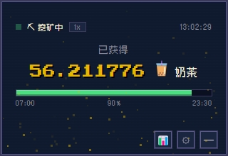

# 💰 MoreMoney — 今天能喝多少杯奶茶？

一个蹲在屏幕右下角、实时帮你算钱的桌面小部件。**绝不暴露真实工资**，只告诉你"已赚 12.345678 杯奶茶"。



## ✨ 特点

- 🕘 **只在上班时间计费** — 默认 9:00–17:30，周末自动停
- 🍵 **休息时间扣除** — 午休、晚饭时间不计工时，配置灵活
- 🧋 **等价物换算** — 奶茶 20 块？手办 1000？显卡 15000？金额全藏起来
- 🎮 **RPG 像素风 UI** — Zpix 像素字体、金色粒子方块、双层描边、经验条进度
- 📅 **日历** — RPG 品质配色日历（普通/优秀/史诗/传说），查看每日工时，月度汇总
- ✏️ **手动打卡** — 点击日历格子记录上下班时间，支持补卡
- 🔄 **右键切换** — 右键日历格子标记为工作日/休息日，灵活应对加班和调休
- 📌 **置顶右下角** — always-on-top，随时瞥一眼
- 🔒 **系统托盘** — 关了不退出，点托盘图标随时唤出
- 🔔 **下班提醒** — 到点自动弹通知，告诉你今天赚了多少
- 🔐 **薪资隐私** — 输入框默认隐藏，点眼睛才显示
- ⚙ **设置面板** — 月薪、工时、休息、等价物随心改

## 🚀 快速开始

```bash
# 安装
npm install

# 开发运行
npm start

# 打包（输出到 dist/）
npm run build
```

> Windows 打包如遇 GitHub 下载慢，设镜像：
> ```cmd
> set ELECTRON_MIRROR=https://npmmirror.com/mirrors/electron/
> set ELECTRON_BUILDER_BINARIES_MIRROR=https://npmmirror.com/mirrors/electron-builder-binaries/
> npm run build
> ```
> winCodeSign 需要管理员权限的符号链接，用管理员 cmd 执行。

## ⌨ 操作

| 操作 | 方式 |
|------|------|
| 移动窗口 | 拖拽顶部区域 |
| 切换等价物 | 点击 🧋 图标 |
| 打开设置 | 点击 ⚙ 按钮 |
| 查看日历 | 点击 📆 按钮 |
| 手动打卡 | 日历页点击格子，选择上下班时间 |
| 切换工作日/休息日 | 日历页右键格子 |
| 最小化到托盘 | 点击 ━ 或关闭窗口 |
| 真正退出 | 右键托盘 → 退出 |

## 📁 配置

配置文件位于 `%APPDATA%\more-money\`，首次启动自动生成：

- `config.json` — 运行配置
- `records.json` — 打卡记录（自动生成，也可手动编辑）

### config.json

```json
{
  "monthlySalary": 25000,
  "workStart": "09:00",
  "workEnd": "17:30",
  "breaks": [
    { "start": "12:00", "end": "13:30" }
  ],
  "reminderEnabled": true,
  "equivalents": [
    { "name": "辣条", "icon": "🌶️", "price": 2 },
    { "name": "奶茶", "icon": "🧋", "price": 20 },
    { "name": "手办", "icon": "👾", "price": 1000 },
    { "name": "显卡", "icon": "🎮", "price": 15000 }
  ],
  "selectedEquivalent": 0
}
```

| 字段 | 说明 |
|------|------|
| `monthlySalary` | 月薪（元） |
| `workStart` / `workEnd` | 上下班时间 |
| `breaks` | 休息时间段，不计工时 |
| `reminderEnabled` | 下班提醒开关 |
| `equivalents` | 等价物列表（名称、图标、单价） |
| `selectedEquivalent` | 当前选中的等价物索引 |

> 工作日默认周一到周五，如需调整可右键日历格子单独标记某天为工作日或休息日。

## 🧮 计薪逻辑

```
秒薪 = 月薪 ÷ 21.75（月均工作日）÷ 8（小时）÷ 3600（秒）
有效工时 = 下班时间 - 上班时间 - 休息总时长
今日已赚 = 秒薪 × 已工作秒数（扣除已过的休息时间）
```

启动时根据当前时间自动算好已赚金额，**不从零开始**。休息时间段内不计费，进度条和金额实时同步。

## 🛠 技术栈

Electron + 原生 HTML/CSS/JS，无前端框架，electron-builder 打包。

- Canvas 2D 粒子系统
- Zpix 中文像素字体 + Press Start 2P 等宽数字字体
- CSS 双层描边 + 扫描线特效
- 法定节假日 + 调休支持（data/holidays.json）

## 📄 License

MIT
